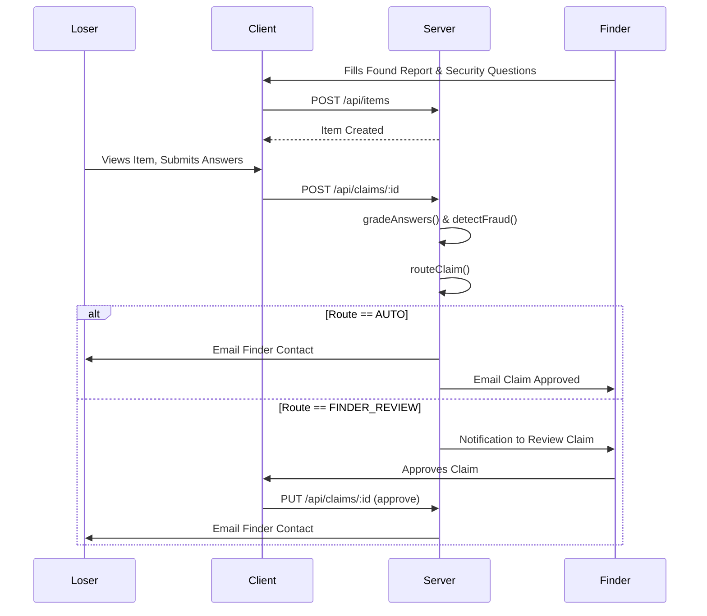

# CIRS - Campus Item Recovery System Documentation

## 1. PROJECT OVERVIEW
The Campus Item Recovery System (CIRS) is a centralized, secure platform designed to help students, faculty, and staff find lost belongings and report found items across a university campus. It replaces traditional, unorganized lost-and-found boxes with a modern web application that leverages fuzzy-matching algorithms, automated grading, and risk-based routing to ensure items are safely returned to their rightful owners.

**Tech Stack:**
- **Frontend:** React (Vite), TailwindCSS, Zustand (State Management), React Router, Lucide React (Icons).
- **Backend:** Node.js, Express.js, MongoDB (Mongoose).
- **Security & Auth:** JWT (JSON Web Tokens), bcryptjs (Password Hashing), Helmet, Rate Limiting.
- **Integrations:** Cloudinary (Image Hosting), Nodemailer (Email Notifications).

**High-Level Architecture:**
The system follows a standard client-server RESTful architecture:
- **Client (`/client`):** A single-page React application. API calls are managed in `/client/src/api/` (via Axios) and global state is managed by Zustand stores (`useAuthStore`, `useItemStore`, `useNotificationStore`).
- **Server (`/server`):** An Express REST API. Requests pass through security middleware, hit modular routers (`/routes`), are processed by controllers (`/controllers`), which interact with MongoDB via Mongoose schemas (`/models`).
- **Core Services:** Background utilities in `/server/utils/` handle email sending, fuzzy matching, claim grading, fraud detection, and risk-based routing.

---

## 2. STEP-BY-STEP PROCESS FLOW

### Flow: Reporting & Claiming a Found Item
1. **Reporting (Finder):** A user finds an item and fills out the "Report Found Item" form (`ReportFoundItem.jsx`).
2. **Uploading:** If an image is provided, it is uploaded to Cloudinary via `uploadRoutes.js`.
3. **Database Insertion:** The item data (including a set of Verification Questions) is saved to the `Item` collection via `itemController.createItem()`.
4. **Auto-Matching:** In the background, `runMatchingForItem()` (in `matchItems.js`) scans the database for unresolved "Lost" reports that match the newly found item.
5. **Browsing (Loser):** A user who lost an item browses the dashboard and clicks on the found item (`ItemDetail.jsx`).
6. **Submitting a Claim:** The loser fills out the verification questions (`SubmitClaim.jsx`).
7. **Processing the Claim:** The frontend sends the answers to `POST /api/claims/:itemId` (`claimController.submitClaim()`).
8. **Grading & Fraud Check:** The system grades the answers using `fuzzyMatch.js` and checks for suspicious activity using `fraudDetection.js`.
9. **Risk Routing:** The claim is routed to either `AUTO` (automatically approved), `FINDER_REVIEW` (sent to the finder for manual review), or `ADMIN_REVIEW` using `riskRouter.js`.
10. **Notification:** Notifications are generated (`notificationController.js`) and emails are dispatched (`sendEmail.js`) to alert the finder or claimant.
11. **Handover:** If approved, contact details are exchanged via email so the students can meet in person.

---

## 3. CORE LOGIC / BUSINESS RULES

### A. Contacting a Lost Item Reporter ("I found this")
- **File:** `itemController.contactItem`
- **Trigger:** A user clicks "I found this" on an item reported as 'lost'.
- **Rules/Gates:**
  - **Gate 1 (Verified):** The finder's email must be verified (`user.isVerified === true`).
  - **Gate 2 (Age):** The finder's account must be at least 24 hours old.
  - **Gate 3 (Duplicate):** A user cannot request contact for the exact same item twice.
  - **Gate 4 (Rate Limit):** A user can make a maximum of 3 contact requests across the platform per 24 hours.
- **Output:** If all gates pass, the system emails the loser with the finder's contact info, and returns the loser's contact info to the finder.

### B. Anti-Fraud Detection
- **File:** `fraudDetection.js`
- **Trigger:** Evaluated every time a claim is submitted (`claimController.submitClaim`).
- **Inputs:** `claimantId`, `answers`, `locationHint`, `item.location`.
- **Rules:**
  - `high_claim_frequency`: > 3 claims submitted by this user in the past 7 days.
  - `repeated_failures`: >= 2 claims rejected for this user in the past 30 days.
  - `low_quality_answers`: The average length of the submitted answers is < 3 characters.
  - `location_mismatch`: The `locationHint` shares absolutely 0 words (length > 2) with the `item.location`.
- **Output:** An array of flags (e.g., `['low_quality_answers']`). If the array is not empty, it triggers an `ADMIN_REVIEW`.

### C. Risk-Based Routing
- **File:** `riskRouter.js`
- **Trigger:** After a claim is graded and fraud-checked.
- **Rules:**
  - If `category` is "Money" or "Cards" -> **Always** `FINDER_REVIEW`.
  - If Fraud Flags > 0 -> **Always** `ADMIN_REVIEW`.
  - If `item.riskLevel` is "HIGH" -> `ADMIN_REVIEW`.
  - If `item.riskLevel` is "MEDIUM" -> `FINDER_REVIEW`.
  - If `item.riskLevel` is "LOW" AND `compositeScore >= 75` -> `AUTO` (Auto-Approved).
  - If `item.riskLevel` is "LOW" AND `compositeScore < 75` -> `FINDER_REVIEW`.

---

## 4. GRADING / SCORING SYSTEM

The system evaluates claims using a fuzzy-matching and weighted composite algorithm located in `server/utils/fuzzyMatch.js`.

### Step 1: Base Grading (`answersMatch`)
- Normalizes both the provided answer and correct answer (lowercases, removes punctuation).
- **Strict Numeric Check:** If the correct answer contains numbers, the provided answer MUST contain all of those numbers exactly.
- **Word-Set Match:** If all words from one answer exist in the other (order-independent), it's a match.
- **Fuzzy Levenshtein:** If no numbers are involved and the string is short (<= 30 chars), it allows a typo tolerance of 25% of the string length.

### Step 2: Composite Score Calculation (`calculateCompositeScore`)
The final score (0-100) is a weighted average of four factors:
1. **Answer Accuracy (60% weight):** `(Correct Answers / Total Questions) * 100`
2. **Location Match (15% weight):** Word overlap similarity between the claimant's `locationHint` and the item's stored `location`.
3. **Time Proximity (10% weight):** How close the claimant's `reportedTime` is to the item's `date`.
   - <= 24 hours = 100 pts
   - <= 72 hours = 75 pts
   - <= 1 week = 45 pts
   - <= 30 days = 20 pts
   - Otherwise = 5 pts
4. **Detail Quality (15% weight):** Based on the average character length of the claimant's answers (longer answers indicate more effort/detail).
   - >= 25 chars = 100 pts
   - >= 12 chars = 75 pts
   - >= 6 chars = 45 pts

### Worked Example:
- **Item:** Blue Nike Backpack, Lost at "Main Library 2nd floor", Date: Oct 10th.
- **Questions:** Q: "What brand?", A: "Nike". Q: "What color?", A: "Blue".
- **Claimant Inputs:** Q1: "nike", Q2: "light blue". Hint: "library". Time: Oct 11th.
- **Grading:**
  - Answer Score: 2/2 correct = 100 * 0.60 = **60**
  - Location: "library" overlaps with "Main Library 2nd floor" = ~50 * 0.15 = **7.5**
  - Time: Diff is 24 hours = 100 * 0.10 = **10**
  - Detail: "nike" (4), "light blue" (10). Avg length = 7 = 45 pts * 0.15 = **6.75**
- **Final Composite Score:** 60 + 7.5 + 10 + 6.75 = **84/100**.
- **Routing Result:** Since 84 >= 75 and it's a Low-Risk Bag, the claim is **AUTO APPROVED**.

---

## 5. DATA FLOW

### Data Models
- **User:** Stores authentication details, role (`student`, `admin`), contact info, and verification status.
- **Item:** Stores item metadata, image URLs, search text indexes, verification questions, and an array of `contactRequests`.
- **Claim:** Tracks the state of a recovery attempt (`pending`, `under_review`, `approved`, `rejected`), stores graded answers, composite scores, fraud flags, and a full `auditLog`.
- **Notification:** Ephemeral alerts linking users to actions (`claim_approved`, `claim_submitted`).

### State Flow
- **Client-Side:** `Zustand` holds the master state of the current user session (`useAuthStore`) and the list of fetched items/notifications. Components subscribe to this state and re-render reactively.
- **Server-Side:** Express routes receive JSON payloads, Mongoose schemas validate the data, controllers execute business rules, and MongoDB persists the state.
- **Asynchronous Flow:** Operations like sending emails (Nodemailer) and matching items (`runMatchingForItem`) are executed asynchronously so they do not block the HTTP response cycle.

---

## 6. KEY FILES REFERENCE

| File Path | Purpose | Key Functions / Classes |
| :--- | :--- | :--- |
| `server/controllers/claimController.js` | Manages the entire lifecycle of a claim. | `submitClaim`, `updateClaimStatus`, `approveAndShare` |
| `server/controllers/itemController.js` | CRUD operations for items and "contact finder" gates. | `createItem`, `getItems`, `contactItem` |
| `server/utils/fuzzyMatch.js` | Evaluates claim answers with typo-tolerance and composite weights. | `answersMatch`, `calculateCompositeScore` |
| `server/utils/riskRouter.js` | Determines if a claim is auto-approved or manual. | `routeClaim` |
| `server/utils/fraudDetection.js` | Prevents spamming and guesses via historical checks. | `detectFraud` |
| `server/models/Claim.js` | Mongoose schema defining the complex claim state machine. | `ClaimSchema` (Audit logs, Routing, Score) |
| `client/src/store/useItemStore.js` | Zustand store for fetching and filtering items globally. | `fetchItems`, `addItem` |
| `client/src/pages/ItemDetail.jsx` | Renders a single item, allows claim submission, and lets finders review claims. | `handleUpdateClaim` |

---

## 7. DEPENDENCIES & INTEGRATIONS

- **MongoDB / Mongoose:** Primary database and ORM. Provides text-search indexing.
- **Cloudinary / Multer:** Handles multipart/form-data image uploads, storing images externally and saving the URL strings in MongoDB.
- **Nodemailer:** Connects to an SMTP server (configured via `.env`) to send transactional emails (claim approvals, password resets).
- **Zod / React Hook Form:** Client-side validation ensuring users provide required lengths and formats before hitting the backend.
- **Bcryptjs & JWT:** Handles secure password hashing and stateless session authorization via HTTP headers.

---

## 8. ASSUMPTIONS, LIMITATIONS, AND OPEN QUESTIONS

**Assumptions Made by the Code:**
- **Verification Trust:** The system heavily assumes that finders will write *good* security questions. If a finder writes a question like "What color is it?" and the answer is obvious from the photo, the auto-grading system is easily bypassed. The `checkQuestionQuality` function attempts to warn users about this, but it is currently non-blocking.

**Limitations:**
- **Real-Time Updates:** The notifications rely on polling or page refreshes (`useEffect` on mount). There is no WebSocket/Socket.io implementation for real-time live alerts.
- **Matching Engine Scale:** The `runMatchingForItem` runs synchronously in the background via text search. For a massive dataset (100k+ items), this could bottleneck Node's event loop. A dedicated worker queue (like Redis/Bull) is missing.
- **Role Enforcement:** Admins are present in the schema and RBAC middleware, but the Admin UI scope is currently limited mostly to analytics rather than deep manual intervention of specific claims.

**Open Questions:**
- **Claim Dispute Resolution:** The `Claim` schema defines a `disputed` status, but there are no controller endpoints built yet to handle the workflow if a finder rejects a claim and the claimant wishes to dispute it.
- **Image Deletion:** When an item is deleted, the Cloudinary URL is orphaned. There is no logic to trigger a deletion from Cloudinary to free up storage space.
